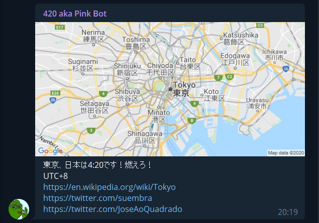

# 420 aka Pink Bot
Bot for Telegram that gives a notification at a certain time in all timezones.

## Visuals

## Usage

You add the bot to your channel and then can see all the commands available with the /help command.

## Support

If you have any suggestion, doubt or contribution you can hit me up in Telegram or Twitter @suembra or create an issue in this repository.

## Contributing

If you want to contribute, please check the CONTRIBUTING.md file first.

To run this bot in your localhost, you have to run *npm install* to install all the dependencies and create a file *.env* that has this variables:

ALARM_MINUTE=20
ALARM_HOUR=4
CHAT_ID=your_chat_id
TOKEN=your_bot_token
MAPS_API_KEY=your_maps_api_key

Obviously, you can change the ALARM_MINUTE and ALARM_HOUR variables to the time you want the notifications. If you don't know how to get the chat id you can see some suggestions in https://stackoverflow.com/questions/36099709/how-get-right-telegram-channel-id/45577616 or https://stackoverflow.com/questions/32423837/telegram-bot-how-to-get-a-group-chat-id.

For a Google Maps API key check https://developers.google.com/maps/documentation/maps-static/get-api-key?hl=pt-PT.

## Project status

This project currently has 3 active contributors and you can see the changes and corrections scheduled in the issues tab.
