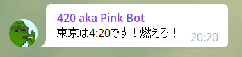

# PinkGlobal420TelegramBot
Bot for Telegram that gives a notification when it's 4:20 around the world. Various timezones supported

## Visuals

## Usage

You just add the bot to your channel and let him do the work.

## Support

If you have any suggestion, doubt or contribution you can hit me up in Telegram @suembra.

## Roadmap

I have some ideas like:

* Command to give how much time is left to the next 4:20
* Command to give how much time is left to the next 4:20 in a specific city
* Command to configure which city appears

## Contributing

If you want to contribute I would be very glad.

To run this bot in your localhost, you have to run *npm install* to install all the dependencies and create a file *.env* that has this variables:

ALARM_MINUTE=20
ALARM_HOUR=4
CHAT_ID= your_chat_id

Obviously, you can change the ALARM_MINUTE and ALARM_HOUR variables to the time you want the notifications. If you don't know how to get the chat id you can see some suggestions in https://stackoverflow.com/questions/36099709/how-get-right-telegram-channel-id/45577616 or https://stackoverflow.com/questions/32423837/telegram-bot-how-to-get-a-group-chat-id.

## Project status

This project is very much in the beggining but I don't have much time so unless someone contributes it's gonna be a slow development.
